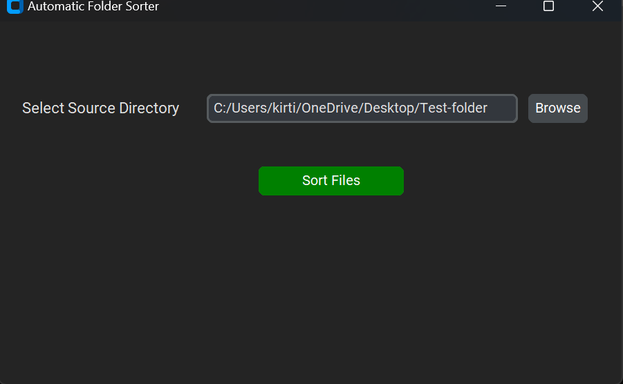
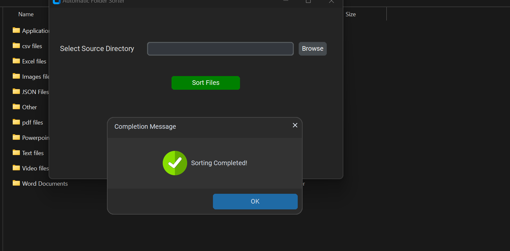

# Automated File Sorter

## Project Description
This project automates file organization within a specified directory, eliminating the need for manual sorting. It categorizes files based on their extensions into pre-defined folders. The latest update includes a user-friendly graphical user interface (GUI) for seamless interaction.

## Key Features
- Supports common file types: CSV files, Image files, Text files, Excel files, PDF files, Video files, Applications, JSON files, PowerPoint presentations, Word documents, and Other files.
- Handles existing folders: Checks if a folder exists before creating it to avoid redundancy.
- File existence verification: Ensures files aren't moved multiple times if already in their designated folders.
- Customizable folder names: You can modify the `new_folder` list in the code to match your preferred folder names.
- User-friendly GUI: A graphical interface for easier file sorting and configuration.

## 🚀 Usage
### Download the Application
Download the `Automated-File-Sorter.exe` file from the repository.

### Run the Application
Double-click the `Automated-File-Sorter.exe` file to launch the GUI application.

### Using the GUI
1. **Select Target Directory**: Use the "Browse" button to navigate to the directory you want to sort.
   
   

2. **Sort Files**: Click the "Sort Files" button to start the sorting process.

3. **View Results**: The application will display a confirmation message once sorting is complete.

   

## ℹ️ Note
This application is intended for personal use. Exercise caution with file organization, especially in critical directories. It's strongly recommended to back up your data before running the application.

## Further Considerations
- Error handling for invalid paths or file operations could be added.
- More granular sorting based on sub-extensions or file content could be implemented.

## New Functions and Modules I Learned
- Integration of GUI components for enhanced user interaction.
- Improved error handling and user prompts within the GUI.
